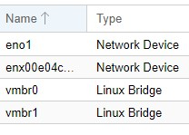
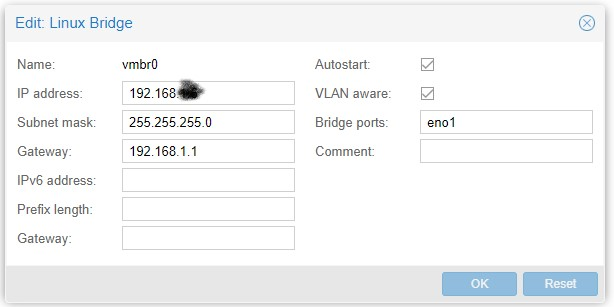
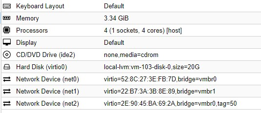
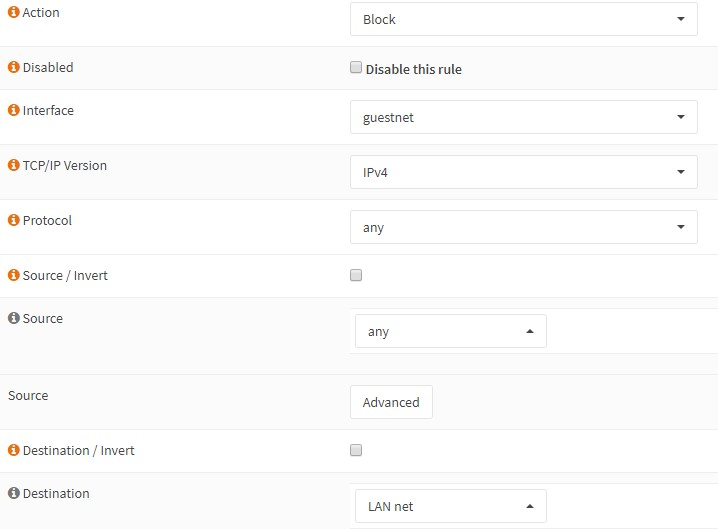
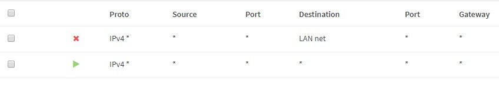
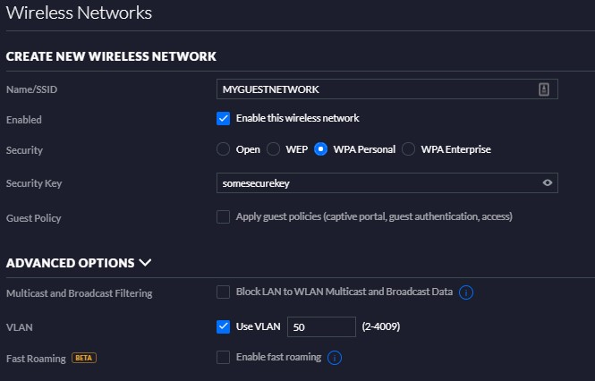

# Firewall setup
A good security gets more and more important, especially when dealing with IoT stuff. What happens it your IoT device gets hacked. How do we make sure it doesnt have full access to your network? Do we know if and where it sends usage and private data?

At least we can make sure we make basic setup of a good firewall and segmented networks using VLANS. We have a wonderful piece of machine in Intel NUC that have alot of machine power left so I decided to use it as a firewall/router too. I am using [OpnSense](https://opnsense.org/download/) software and an extra USB ethernet dongle on the WAN side. I bought two used managed gigabit switches with VLAN capabilites. I also use the Unifi AP capability to set VLAN id to a SSID for the guest wifi and IoT wifi/network. I will explain it in the following chapters. 

The reader takes own responsibility of the security using this guide!

## Proxmox setup
### Networking
I have two networking devices. The built-in ethernet and the usb dongle. For a computer I would advice to buy a normal ethernet card but for a NUC the USB will be fine.

I also have two "Linux bridges", one for WAN (the usb one) and one for the LAN. Very important to add the "VLAN Aware" checkbox. This will make the bridge work like a switch for VLANS.

## Install opnsense
If you want you can read the [full installation guide](https://docs.opnsense.org/manual/install.html) of opnsense. This is how I configured it.

1. Upload the [OpnSense](https://opnsense.org/download/) image. 
2. Create the VM, I use 2048 MiB memory, 3 cores, 20gig storage. GuestOS=Other. Use default LAN network, my case vmbr0.
3. Add the WAN network device
4. Add the VLAN network device in my case with tag=xx
Hardware should look something like this:

    

5. Start the VM and go to console
6. Wait for the installation to end
7. When prompted, login as "installer" and password "opnsense". 
8. Install defaults, now the FW is listening to "192.168.1.1"
9. IMPORTANT, remove ISO from CD for the VM!!!! If you forget this it will start in live mode and no settings will be saved.
10. Use web browser to login to "root" and use "opnsense" as password. Do the wizard. A tip is to use the old routers MAC address if you have binding to outside IP addresses. 
11. After wizard is done you have a basic setup of firewalled WAN/LAN 

## Example of VLAN, Guest network
As an example I use VLAN for guest network Wifi. Same can be applied to setup VLAN for IoT network. 

If you used my example you will have three networking interfaces. Now it is time to configure VLAN for the third taged one. 

### Assign interface
1. Goto Interfaces->Assignments
2. You will se LAN and WAN and a third unassigned one. Click on it and click the enable checkbox
3. Give it following settings and click "Save". Makse sure the subnetmask is NOT 32!!
---------------
| Setting  |  Value  |
|----------|:-------------|
| Description | Your description of the VLAN  |
| IPv4 Configuration Type | Static IPv4      |
| IPv4 address | `10.1.2.1` (example) subnet mask `24` |
| IPv4 Configuration Type | Static IPv4      |

### DHCP
1. Now it is time to activate DHCP. Go to Services->DHCPv4->YOUR_NEW_INTERFACE 
2. Press enable DHCP server
3. Set range from `10.1.2.100` to `10.1.2.200` and click "Save"

### Firewall rules for guestnet
1. Goto Firewall->Rules->YOUR_NEW_INTERFACE
2. Add a block rule that blocks everything from any source to LAN net. (The point with guest network that it cant access any LAN devices)

    

3. Add a allow everything else rule by using all defaults and press save
4. The result should look something like this

### Add the wifi setting
I have a Unifi AP and controller. 

1. Create new network. If you already have a guest wifi setup, make sure your VLAN tag is the same. You will find the VLAN setting under ADVANCED OPTIONS. 

If you want you can setup more advanced guest network capabilities, like "apply guest policies" settings. 
2. Now you can use a device to connect to the new guest network and make sure it get correct ip and gateway. Also check if you can reach internet and not get to local LAN devices. Important to test this!!!