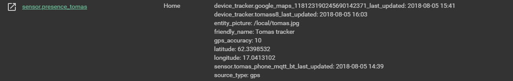

# Setup a better presence 
I wanted to make a better precense in code rather than in Hass configurations. It ended up with a appdaemon app that takes three different device trackers input and make a solid one.

Checkout 
https://philhawthorne.com/making-home-assistants-presence-detection-not-so-binary/ if you want to know what inspired me.

Basically I want the state to go:

```
Home->Just left->Away->Zone

Home->Just left->Home

Away->Just arrived->Home

```
# Detailed guide
## 1. Setup device trackers
This guide use nmap for wifi tracker, google maps for gps tracker and my own script based MQTT tracker for bluetooth. You can just use the type of tracker that works for you. The important thing is to use all different types, wifi, bluetooth and gps. If you have a very stable bluetooth or stable wifi you could use only the stable one. Best results always with all three. 

### Bluetooth 
Check out https://github.com/helto4real/hassio/tree/master/docker/nuc_bluetooth for my specific config but also try the built in tracker in hass. It works in most cases. https://www.home-assistant.io/components/device_tracker.bluetooth_tracker/

### Wifi
I use the nmap to track devices see https://www.home-assistant.io/components/device_tracker.nmap_tracker/ how to set that up. But there are other trackers too that connects to your router or unifi AP:s. 

### GPS
For GPS you can use trackers like owntracks or iCloud. I use Google maps tracker. See https://www.home-assistant.io/components/device_tracker.google_maps/ to set it up. *It is very important to make a specific google account to use for Home Assistant. For security reasons and that this tracker doesn´t support two way authentication. 

## 2. Create group

- Use three different device_trackers, one gps, one wifi and one bluetooth and put that in a hass group. 

Example from my setup:

```yaml
group:
  tomas_devices:
    name: Tomas hemma
    view: no
    entities:
      - sensor.tomas_phone_mqtt_bt #Bluetooth
      - device_tracker.google_maps_118123190245690142371 #Gps 
      - device_tracker.tomass8 # wifi
```

## 3. Copy the appdaemon app and configure it all
Copy the `presence.py` file from https://github.com/helto4real/hassio/tree/master/appdaemon/apps/presence

In your appdaemon yaml configurations file set the following settings
```yaml
app_presence_phone:
  module: presence
  class: a_better_presence
  name: presence_tomas            # name of the device in Hass
  friendly_name: 'Tomas tracker'  # display name
  timer: 600                      # timeout in seconds from just arrived to home and just left to away (10 min)
  update_time: 7200               # how old reported values get to be before reporting not_home (2hr)
  group_devices: group.tomas_devices # The group that contains the tracked devices

```

## 4. Check your status page
A new device called `sensor.[your name] should now been created


